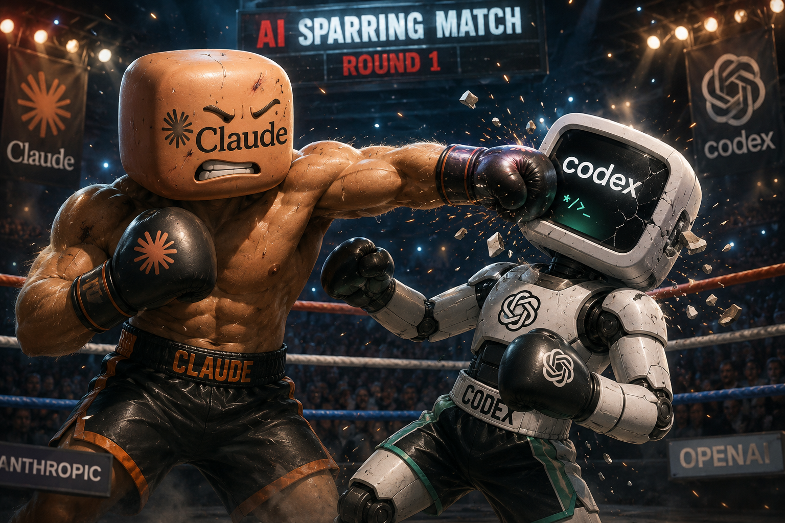

# claude-code-sparring

<p align="center">
  
</p>

**One AI argues your side. Another tears it apart. Up to 6 structured rounds.**

Default pairing: **Claude Opus (advocate) vs GPT (critic)**. Both sides are fully configurable — swap in Gemini, use API keys, mix and match.

Most "debate this topic" prompts ask one model to argue both sides — same biases, same blind spots, no real pressure. This skill pits two models from different companies against each other, with a research phase that actually understands your context before anyone starts arguing.

<p align="center">
  
</p>

---

## How It Works

```
/sparring [your topic]
```

**Phase 1 — Research**
Scans your workspace files, reads relevant context, checks conversation history, runs web searches if the topic touches the outside world. Builds a context brief so the advocate argues *your* actual position, not a generic one.

**Phase 2 — Structured sparring (up to 6 rounds)**
- 🟢 Advocate opens with 3–5 arguments grounded in your actual context
- 🔴 Critic attacks: blind spots, hidden assumptions, weak evidence, edge cases
- Rounds continue until convergence or 6 rounds — convergence must be explicitly signaled, not assumed

**Phase 3 — Synthesis**
What survived, what changed, what the critic conceded, what stayed unresolved.

---

## Setup

### 1. Install

```bash
git clone https://github.com/gyujeongion/claude-code-sparring ~/.claude/skills/sparring
chmod +x ~/.claude/skills/sparring/bin/ask.sh ~/.claude/skills/sparring/bin/advocate.sh
```

### 2. Configure models

Pick one option per role. Auto-detection runs in the order listed.

#### Advocate (default: Claude Opus)

| Option | How |
|--------|-----|
| Claude Code Architect | Just use Claude Code — `delegate_task` is called automatically |
| Anthropic API | `export ANTHROPIC_API_KEY=sk-ant-...` |
| OpenAI API | `export OPENAI_API_KEY=sk-...` + `export SPARRING_ADVOCATE_BACKEND=openai` |
| Gemini API | `export GOOGLE_API_KEY=...` + `export SPARRING_ADVOCATE_BACKEND=gemini` |
| Codex CLI | `npm i -g @openai/codex && codex login` + `export SPARRING_ADVOCATE_BACKEND=codex` |
| agy CLI | Install agy + `export SPARRING_ADVOCATE_BACKEND=agy` |

#### Critic (default: GPT)

| Option | How |
|--------|-----|
| Codex CLI (ChatGPT Plus, free) | `npm i -g @openai/codex && codex login` |
| OpenAI API | `export OPENAI_API_KEY=sk-...` |
| agy CLI | Install agy + `export SPARRING_CRITIC_BACKEND=agy` |
| Gemini API | `export GOOGLE_API_KEY=...` + `export SPARRING_CRITIC_BACKEND=gemini` |
| Anthropic API | `export ANTHROPIC_API_KEY=sk-ant-...` + `export SPARRING_CRITIC_BACKEND=anthropic` |

### 3. Model overrides (optional)

```bash
export SPARRING_ADVOCATE_MODEL=claude-opus-4-8   # default for anthropic backend
export SPARRING_CRITIC_MODEL=gpt-4o              # default for openai backend
```

---

## Example combos

```bash
# Default: Claude Opus vs GPT (Claude Code users)
/sparring Should we migrate to microservices?

# Gemini vs GPT (API keys only, no Claude Code)
export SPARRING_ADVOCATE_BACKEND=gemini
export SPARRING_CRITIC_BACKEND=openai
/sparring Is the new pricing model sustainable?

# GPT as advocate, Gemini as critic
export SPARRING_ADVOCATE_BACKEND=openai
export SPARRING_CRITIC_BACKEND=gemini
/sparring Should we launch in Q3 or wait for Q1?
```

---

## Example output

```
📋 Research complete.
Scanned: architecture docs, 3 decision logs, tech stack notes
Web: microservices vs monolith 2025 case studies
Refined agenda: "Migrating to microservices now is worth the 4-month cost
given the team's current scaling pain points."

Advocate: Claude Opus — Critic: gpt-4o — max 6 rounds. Start? y

[Round 1 — Advocate] Independent deployability eliminates the current release
  coordination bottleneck that cost us 3 weeks last quarter...
[Round 1 — Critic] The team has 6 engineers. Conway's Law means you'll build
  6 services that couple anyway. Distributed monolith is worse than the original...
[Round 2 — Advocate] Domain-driven boundaries are defined before splitting —
  the coupling risk is a planning failure, not an architecture one...
...

━━━━━━━━━━━━━━━━━━━━━━━━━━━━━━━━━━
Final Verdict: Conditional yes — migration is defensible with explicit domain
modeling upfront. The critic's Conway's Law objection was the strongest and
remains partially unresolved without a team structure change.
```

---

## Sensitive data

The skill never sends raw personal financials, contracts, or private strategy to external models. The research phase anonymizes before passing context to the critic.

---

## License

MIT — see [LICENSE](LICENSE)
